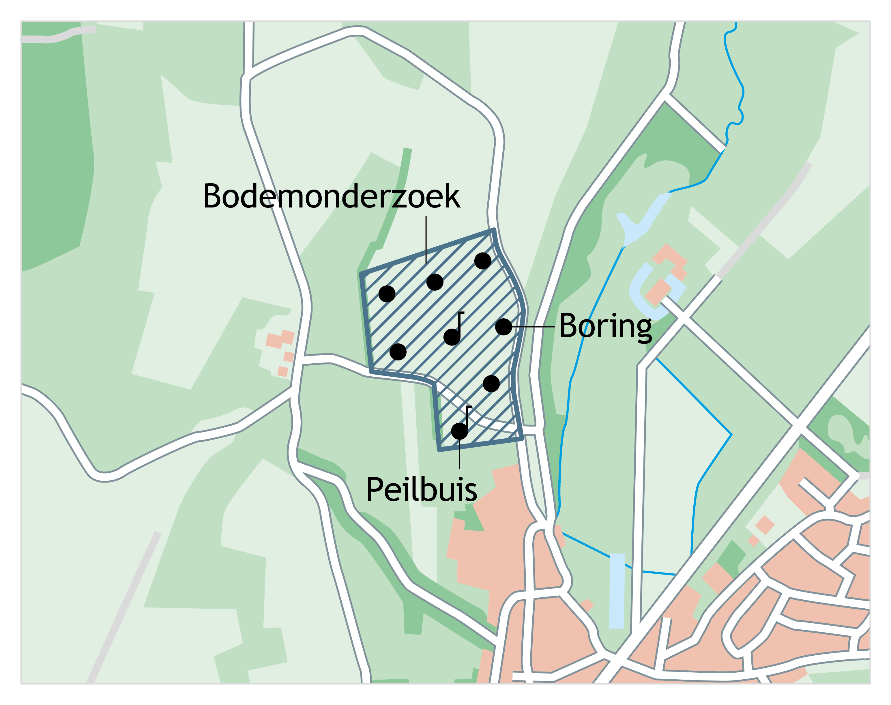

# Milieuhygiënisch bodemonderzoek

## Inleiding
De catalogus voor het milieuhygiënisch bodemonderzoek beschrijft de gegevens die in de registratie ondergrond zijn opgenomen van een bodemonderzoek dat vanuit het vakgebied milieukwaliteit is uitgevoerd. Het vakgebied milieukwaliteit is het vakgebied waar gekeken wordt naar het voorkomen van verontreinigende stoffen in de bodem. Bodem is in de scope van BRO milieukwaliteit gedefinieerd als de landbodem (incl. droge oevergebieden) bestaande uit zowel grond, als grondwater.

Een milieuhygiënisch bodemonderzoek bestaat uit het geheel van gegevens uit archiefonderzoek en/of veldonderzoek zoals boringen, peilbuizen, de beschrijving van bodemlagen, veldwaarnemingen, de resultaten van analyses op grond en/of grondwater en een aantal gegevens uit het samenvattende onderzoeksrapport. De locatie van het bodemonderzoek is vastgelegd in de contour van de onderzoekslocatie.

Hiermee is ook het onderscheid vastgelegd tussen de registratieobjecten die betrekking hebben op de domeinen <i>bodem- en grondonderzoek</i> en <i>grondwatermonitoring</i>. Binnen deze domeinen is de registratie van de gegevens georganiseerd in losse registratieobjecten zoals <i>booronderzoek</i>, <i>grondwatermonitoringput</i>, <i>grondwatersamenstellingsonderzoek</i>. Het <i>milieuhygiënisch bodemonderzoek</i> wordt altijd als een geïntegreerd geheel geregistreerd en heeft als doel het onderzoek naar het voorkomen van verontreinigende stoffen.

## Belangrijkste entiteiten

### Bodemonderzoek
Deze entiteit draagt de naam van het registratieobject zelf en bevat een vijftal algemene gegevens van het registratieobject, die voor ieder registratieobject van toepassing zijn. De algemene gegevens hebben betrekking op het registratieobject zelf; de unieke identificatie (BRO-ID), de bronhouder, de dataleverancier en het van toepassing zijnde <i>kwaliteitsregime</i> (IMBRO/A of IMBRO) van aanlevering.

Daarnaast bevat de entiteit enkele gegevens van het bodemonderzoek zoals de aanleiding van het onderzoek, het type onderzoek, de contour van de onderzoekslocatie, de rapportgegevens en de belangrijkste conclusies van het onderzoeksbureau. De conclusie van het onderzoeksbureau wordt gezien als informatief en dus niet-authentiek. Tevens bevat deze entiteit het zogenaamde ‘SIKB-ID’ (unieke SIKB0101 Identificatie in de vorm van een GUID), waaronder het onderzoek in de ketensystemen is vastgelegd.  
Het bodemonderzoek bevat een drietal zogenaamde gegevensgroepen; de <i>Gestandaardiseerde locatie</i> (BRO generiek), de <i>Registratiegeschiedenis</i> (BRO generiek) en de rapportgegevens.

<figure>
	
	<figcaption>
		Milieuhygiënisch bodemonderzoek.
	</figcaption>
</figure>

### Registratiegeschiedenis
De registratiegeschiedenis van een milieuhygiënisch bodemonderzoek geeft de essentie van de geschiedenis van het object in de registratie ondergrond, de zgn. formele geschiedenis. De registratiegeschiedenis vertelt bijvoorbeeld wanneer een object is geregistreerd en of er na registratie correcties zijn doorgevoerd. Deze gegevensgroep wordt niet aangeleverd maar intern binnen de registratie ondergrond vastgelegd.
			
### Gestandaardiseerde locatie
De geometrie van het milieuhygiënisch bodemonderzoek kan worden aangeleverd ten opzichte van drie referentiestelsels (RD, ETRS89 en WGS84). Binnen de basisregistratie ondergrond worden gegevens die aangeleverd zijn volgens RD of WGS84 volgens een gedefinieerde methodiek omgezet naar ETRS89. Deze bewerking vindt plaats binnen de BRO zodat aan de uitgifte kant altijd kan worden uitgeleverd in ETRS89 én het oorspronkelijk aangeleverde referentiestelsel. De gestandaardiseerde locatie wordt vastgelegd, evenals de methode waarop de transformatie is uitgevoerd. Deze gegevensgroep heeft geen invloed op de aanlevering.

### Rapport
Binnen deze gegevensgroep is een viertal kenmerken van het rapport vastgelegd. Een rapportnummer, een rapportdatum, een rapporteur en de URL waar rapport te downloaden is. Onder de rapporteur wordt verstaan de naam van het onderzoeksbureau zoals op het rapport vermeld. Aangezien deze gegevens niet gestandaardiseerd beschikbaar zijn kan dit gegeven worden aangeleverd als vrije tekst. Dit betekent dat deze gegevens dus informatief en niet-authentiek zijn.
			
### Meetpunt
Deze entiteit bevat de gegevens die het meetpunt identificeren inclusief de belangrijkste administratieve gegevens en de informatie over de geometrie van de meetpunt(en) die zijn geplaatst in het kader van het onderzoek. Diepten van het meetpunt worden standaard gerefereerd aan het maaiveld. Indien de hoogte van het maaiveld bekend is kan dit worden gerefereerd aan een vast referentievlak. Binnen dit registratieobject is dat NAP.  
Het meetpunt bevat vervolgens een boorbeschrijving, een boorprofiel en een beschrijving van de bodemlagen en bijzonderheden. Deze onderdelen zijn in het model ondergebracht in aparte entiteiten.
			
### Grondmonstername, grondmonsteranalyse en mengmonsteranalyse
Deze entiteiten bevatten de gegevens van de grondmonstername en de grondmonsters die worden genomen tijdens het plaatsen van het meetpunt. Grondmonsters kunnen binnen een milieuhygiënisch bodemonderzoek worden samengesteld tot een mengmonster. De (meng-)monsters worden vervolgens ter analyse aangeboden aan het laboratorium. Deze entiteiten zijn nodig om een goede koppeling te maken met de resultaten van de uitgevoerde analyses.

### Filter
Deze entiteit bevat de gegevens die de filters identificeren, inclusief de belangrijkste administratieve gegevens en de informatie over de ligging van de filter(s) die zijn geplaatst in het kader van het onderzoek. De diepte van een peilfilter wordt gerefereerd aan de bovenkant van de peilbuis of aan het maaiveld. Indien een verticaal referentievlak beschikbaar is kan deze vervolgens worden gerefereerd aan NAP.

### Grondwatermonstername en grondwateranalyse
Deze entiteiten bevatten de gegevens van de grondwatermonstername uit de filter en de grondwatermonsters die vervolgens ter analyse worden aangeboden aan het laboratorium. Deze entiteiten zijn nodig om een goede koppeling te maken met de resultaten van de uitgevoerde analyses. Tevens kan vanuit de grondwatermonstername een koppeling worden gelegd met de veldwaarnemingen en veldmetingen.
			
### Analyse
Deze entiteit bevat de resultaten van de analyses die door een laboratorium worden uitgevoerd op de aangeleverde grondmonsters, mengmonsters van grondmonsters of grondwatermonsters.

### Analysemethode
Deze entiteit bevat de gegevens over de analysemethode die op het laboratorium is gebruikt.

## INSPIRE
Het doel van de Europese kaderrichtlijn INSPIRE is het harmoniseren en openbaar maken van ruimtelijke gegevens van overheidsorganisaties ten behoeve van het milieubeleid. Het registratieobject milieuhygiënisch bodemonderzoek valt niet onder een bestaand INSPIRE-thema. Mogelijk zal hier op een later tijdstip invulling aan worden gegeven.
