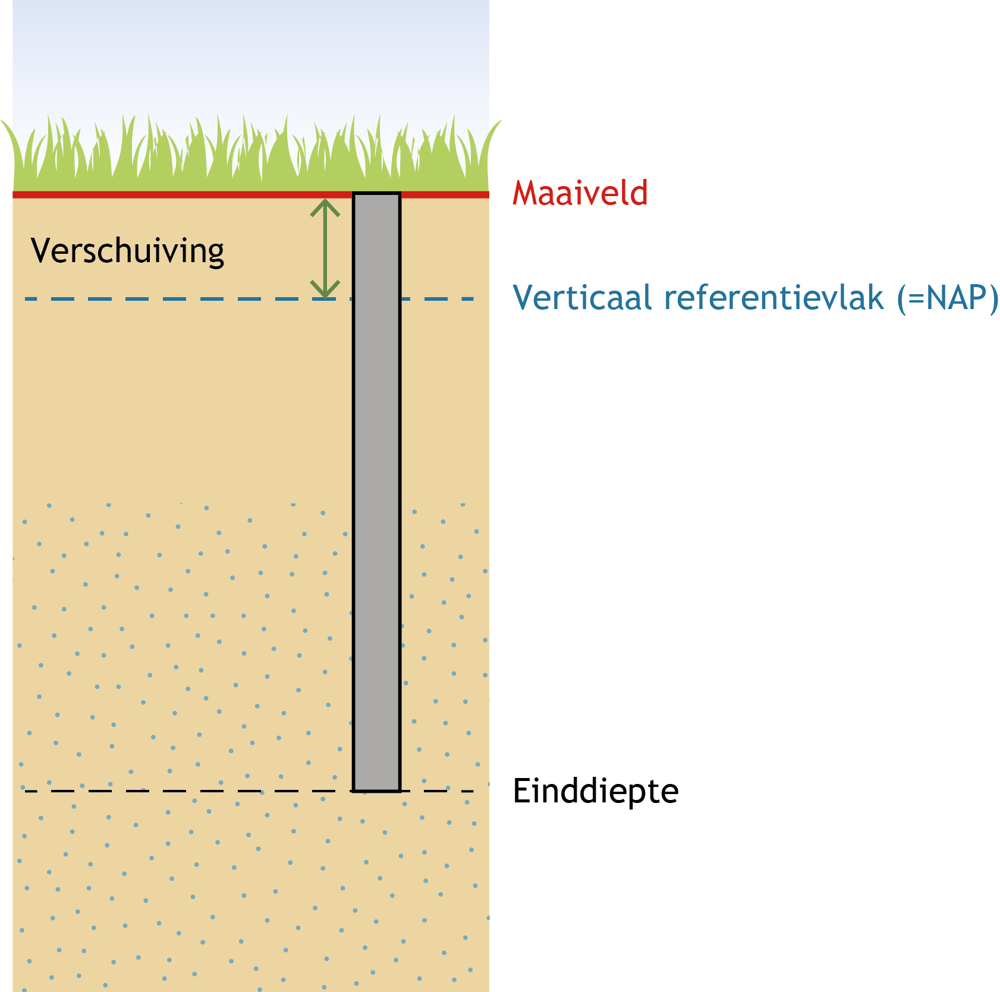
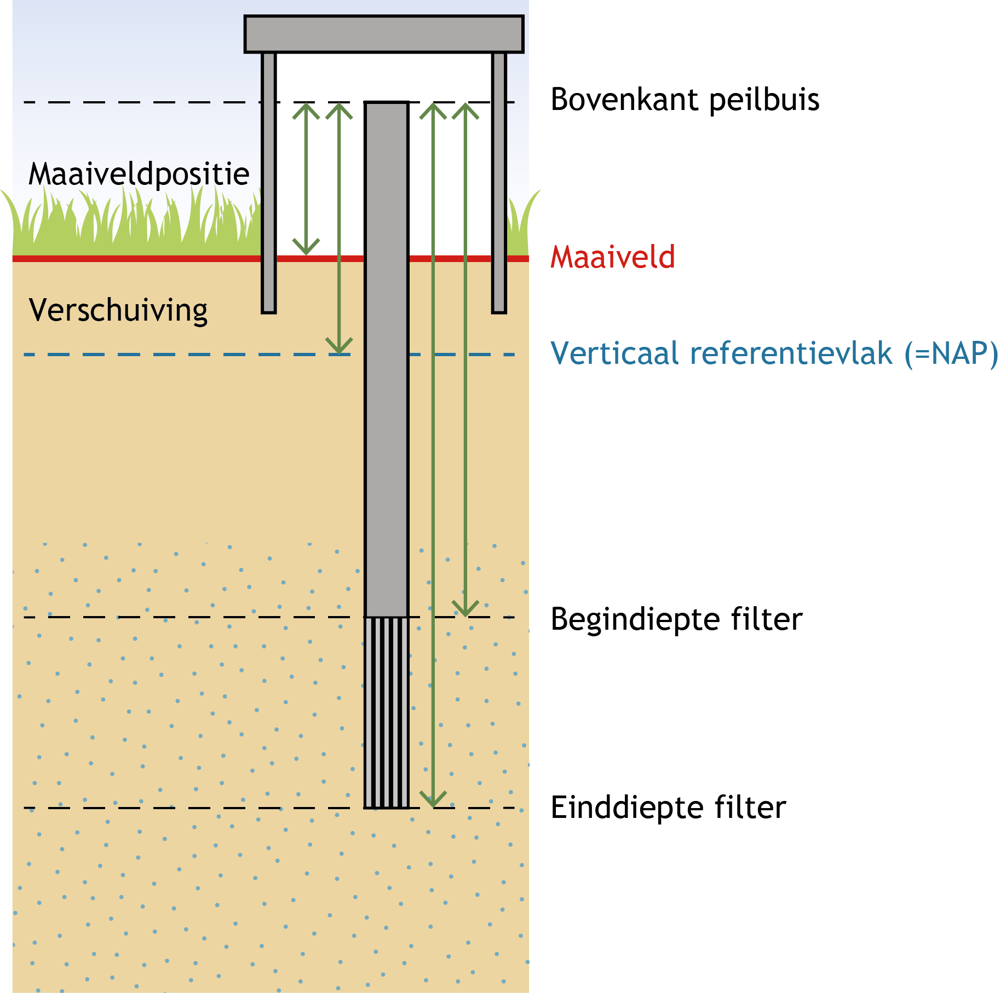
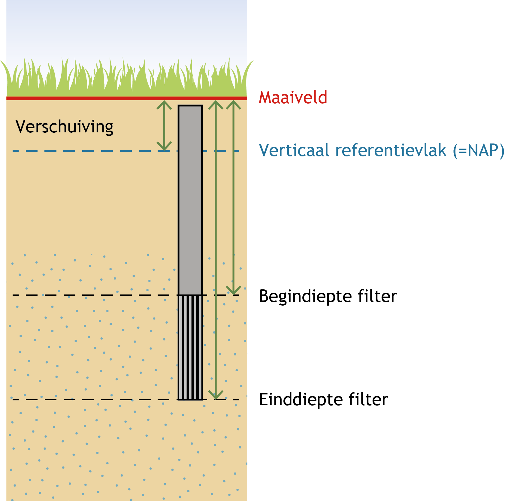

# Milieuhygiënisch bodemonderzoek

## Inleiding
De catalogus voor het milieuhygiënisch bodemonderzoek beschrijft de gegevens die in de registratie ondergrond zijn opgenomen van een bodemonderzoek dat vanuit het vakgebied milieukwaliteit is uitgevoerd. Het vakgebied milieukwaliteit is het vakgebied waar gekeken wordt naar het voorkomen van verontreinigende stoffen in de bodem.

Een milieuhygiënisch bodemonderzoek bestaat uit het geheel van gegevens uit archiefonderzoek en/of veldonderzoek zoals boringen, peilbuizen, de beschrijving van bodemlagen, veldwaarnemingen, de resultaten van analyses op grond en/of grondwater en een aantal gegevens uit het samenvattende onderzoeksrapport. De locatie van het bodemonderzoek is vastgelegd in de contour van de onderzoekslocatie.

Hiermee is ook het onderscheid vastgelegd tussen de registratieobjecten die betrekking hebben op de domeinen <i>bodem- en grondonderzoek</i> en <i>grondwatermonitoring</i>. Binnen deze domeinen is de registratie van de gegevens georganiseerd in losse registratieobjecten zoals <i>booronderzoek</i>, <i>grondwatermonitoringput</i>, <i>grondwatersamenstellingsonderzoek</i>. Het <i>milieuhygiënisch bodemonderzoek</i> wordt altijd als een geïntegreerd geheel geregistreerd en heeft als doel het onderzoek naar het voorkomen van verontreinigende stoffen.

Het registratieobject <i>milieuhygiënisch bodemonderzoek</i> wordt in zijn geheel in één keer aangeleverd en kent geen mogelijkheid tot aanvullingen  nadat het brondocument is aangeleverd (geen materiële geschiedenis). Fouten in de registratie kunnen worden gecorrigeerd door middel van een correctiebericht.

## Belangrijkste entiteiten

### Bodemonderzoek
Deze entiteit draagt de naam van het registratieobject zelf en bevat een vijftal algemene gegevens van het registratieobject, die op ieder registratieobject van toepassing zijn. De algemene gegevens hebben betrekking op het registratieobject zelf; de unieke identificatie (BRO-ID), de bronhouder, de dataleverancier en het van toepassing zijnde <i>kwaliteitsregime</i> (IMBRO of IMBRO/A) van aanlevering.

Daarnaast bevat de entiteit enkele gegevens van het bodemonderzoek zoals de aanleiding van het onderzoek, het type onderzoek, de contour van de onderzoekslocatie, de rapportgegevens en de belangrijkste conclusies van het onderzoeksbureau. De conclusie van het onderzoeksbureau wordt gezien als informatief en dus niet-authentiek. Tevens bevat deze entiteit het zogenaamde ‘SIKB-ID’ (unieke SIKB0101 Identificatie in de vorm van een GUID), waaronder het onderzoek in de ketensystemen is vastgelegd.  
Het bodemonderzoek bevat een drietal zogenaamde gegevensgroepen; de <i>Gestandaardiseerde locatie</i> (BRO generiek), de <i>Registratiegeschiedenis</i> (BRO generiek) en de rapportgegevens.

<figure>
	
	<figcaption>
		Milieuhygiënisch bodemonderzoek.
	</figcaption>
</figure>

### Registratiegeschiedenis
De registratiegeschiedenis van een milieuhygiënisch bodemonderzoek geeft de essentie van de geschiedenis van het object in de registratie ondergrond, de zgn. formele geschiedenis. De registratiegeschiedenis vertelt bijvoorbeeld wanneer een object is geregistreerd en of er na registratie correcties zijn doorgevoerd. Deze gegevensgroep wordt niet aangeleverd maar intern binnen de registratie ondergrond vastgelegd.
			
### Gestandaardiseerde locatie
De geometrie van het milieuhygiënisch bodemonderzoek kan worden aangeleverd ten opzichte van drie referentiestelsels (RD, ETRS89 en WGS84). Binnen de basisregistratie ondergrond worden gegevens die aangeleverd zijn volgens RD of WGS84 volgens een gedefinieerde methodiek omgezet naar ETRS89. Deze bewerking vindt plaats binnen de BRO zodat aan de uitgiftekant altijd kan worden uitgeleverd in ETRS89 én het oorspronkelijk aangeleverde referentiestelsel. De gestandaardiseerde locatie wordt op basis van de aanlevering automatisch vastgelegd.

### Rapport
Binnen deze gegevensgroep is een viertal kenmerken van het rapport met de resultaten van het bodemonderzoek vastgelegd. Een rapportnummer, een rapportdatum, een rapportauteur en de URL waar het rapport te downloaden is. Onder de rapportauteur wordt verstaan de naam van het onderzoeksbureau zoals op het rapport vermeld is. Aangezien dit gegeven niet gestandaardiseerd beschikbaar is het worden aangeleverd als vrije tekst. Dit betekent dat dit gegeven dus informatief en niet-authentiek is.
			
### Meetpunt
Deze entiteit bevat de gegevens die het meetpunt (bijvoorbeeld boring of peilbuis) identificeren inclusief de belangrijkste administratieve gegevens en de informatie over de geometrie van de meetpunten die zijn geplaatst in het kader van het onderzoek. Diepten van een meetpunt worden standaard gerefereerd aan het maaiveld. Indien de hoogte van het maaiveld bekend is, kan worden gerefereerd aan een vast referentievlak. Binnen dit registratieobject is dat NAP. De hoogte ten opzichte van NAP wordt vastgelegd middels het gegeven 'verschuiving'. 

<figure>
	
	<figcaption>
		Verticale positie van een meetpunt.
	</figcaption>
</figure>

Het meetpunt kan vervolgens een boorbeschrijving, een boorprofiel en een beschrijving van de bodemlagen en bijzonderheden bevatten. Deze onderdelen zijn in het model ondergebracht in aparte entiteiten.

### Asbestresultaat
Deze entiteit bevat informatie over eventueel tijdens het onderzoek aangetroffen asbest. Het voorkomen van asbest wordt bepaald per meetpunt of een verzameling meetpunten waarbij tevens de diepte is aangegeven waarop mogelijk asbest is aangetroffen. Het resultaat wordt uitgedrukt in een gewogen gehalte. Er kan worden aangegeven of tijdens de veldwerkzaamheen asbestdeeltjes (bijvoorbeeld brokjes of plaatmateriaal) zijn aangetroffen. 

### Grondmonstername, grondmonsteranalyse en mengmonsteranalyse
Deze entiteiten bevatten de gegevens van de grondmonstername en de grondmonsters die worden genomen tijdens het plaatsen van het meetpunt. Grondmonsters kunnen binnen een milieuhygiënisch bodemonderzoek worden samengesteld tot een mengmonster. De (meng)monsters worden vervolgens ter analyse aangeboden aan het laboratorium. Deze entiteiten zijn nodig om een goede koppeling te maken met de resultaten van de uitgevoerde analyses.

### Filter
Deze entiteit bevat de gegevens die de filters identificeren, inclusief de belangrijkste administratieve gegevens en de informatie over de ligging van de filters die zijn geplaatst in het kader van het onderzoek. De diepte van een peilfilter wordt bij voorkeur gerefereerd aan de bovenkant van de peilbuis. Deze kan zich boven of onder het maaiveld bevinden. Deze situatie is opgenomen in figuur 6 (met situatie bovenkant peilbuis boven het maaiveld). De hoogte van de bovenkant peilbuis ten opzichte van het maaiveld wordt vastgelegd in het gegeven ‘maaiveldpositie’. Deze kan positief (boven maaiveld) of negatief zijn (onder maaiveld).

<figure>
	
	<figcaption>
		Referentie bovenkant van de peilbuis.
	</figcaption>
</figure>  

In sommige gevallen (met name oude data) kan het zijn dat de filterdiepte (net als de bodemlagen) is gerefereerd aan het maaiveld. Deze situatie is opgenomen in figuur 7. Omdat de bovenkant peilbuis als gegeven ontbreekt, ontbreekt ook de ‘maaiveldpositie’. 

<figure>
	
	<figcaption>
		Referentie maaiveld.
	</figcaption>
</figure>  

De bovenkant van de peilbuis of, in de tweede situatie, het maaiveld kunnen gerefereerd worden aan een verticaal referentievlak (NAP). Dit wordt vastgelegd middels het gegeven 'verschuiving'.

### Grondwatermonstername en grondwateranalyse
Deze entiteiten bevatten de gegevens van de grondwatermonstername uit de filter en de grondwatermonsters die vervolgens ter analyse worden aangeboden aan het laboratorium. Deze entiteiten zijn nodig om een goede koppeling te maken met de resultaten van de uitgevoerde analyses. Tevens kan vanuit de grondwatermonstername een koppeling worden gelegd met de veldwaarnemingen en veldmetingen.

### Veldwaarnemingen en veldmeting
Deze entiteiten bevatten de waarnemingen en resultaten van metingen zoals die zijn gedaan tijdens de monstername. De veldmetingen kunnen betrekking hebben op zowel grond als grondwater.
   
### Analyse
Deze entiteit bevat de resultaten van de analyses die door een laboratorium worden uitgevoerd op de aangeleverde grondmonsters, mengmonsters van grondmonsters of grondwatermonsters.

### Analyseproces
Deze entiteit bevat de gegevens over de analysemethode die door het laboratorium is gebruikt.

## INSPIRE
Het doel van de Europese kaderrichtlijn INSPIRE is het harmoniseren en openbaar maken van ruimtelijke gegevens van overheidsorganisaties ten behoeve van het milieubeleid. Het registratieobject milieuhygiënisch bodemonderzoek valt onder het INSPIRE-thema Geology, en om die reden moeten de gegevens in het registratieobject geschikt gemaakt worden voor uitwisseling volgens de INSPIRE-standaard. Dit wordt geïmplementeerd middels een mapping van het gegevensmodel van het milieuhygiënisch bodemonderzoek op het gegevensmodel van het INSPIRE-thema. De inhoud van deze mapping is geen onderdeel van deze catalogus.
